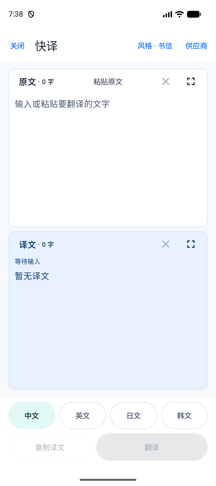
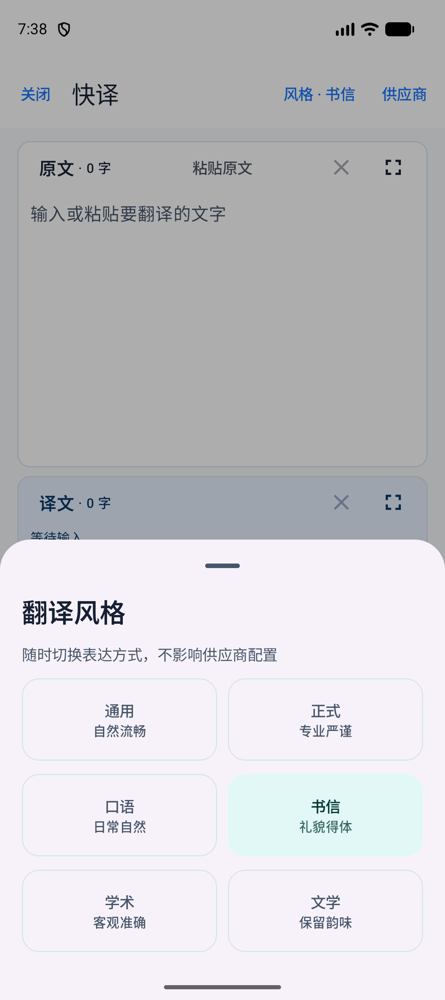
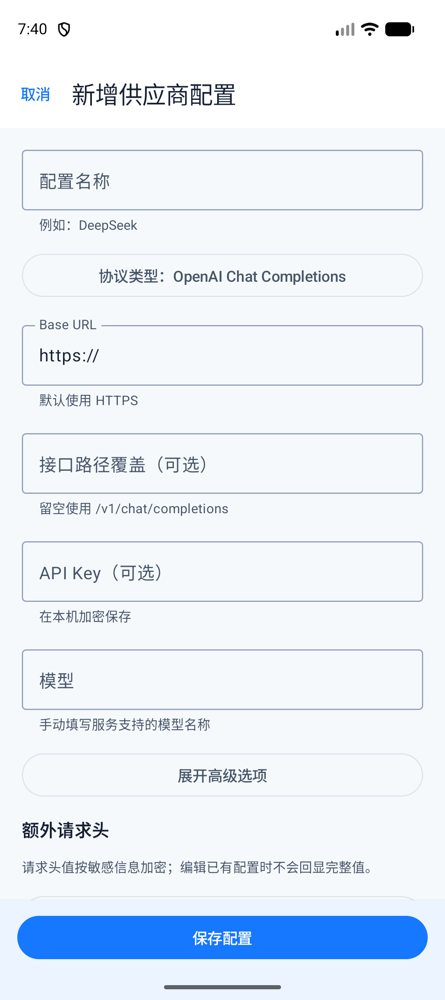

<div align="center">

# 快译

**简洁、快速、可自定义 AI 供应商的 Android 翻译工具**

[](https://github.com/Tediang/fanyi/actions/workflows/android-release.yml)


[下载最新版](https://github.com/Tediang/fanyi/releases/latest) · [安装与配置](docs/testing/install-and-configure.md) · [可行性调研](docs/research/android-translation-app-feasibility.md)

</div>

快译面向“看到文字，马上翻译”的场景：从浏览器的选词菜单、系统分享、Moto AI 快捷键或手动输入接收文本，再交给你配置的云端或自建大语言模型。界面只保留翻译需要的内容，不提供账号、广告、信息流或历史记录。

## 界面预览

<table>
  <tr>
    <td align="center"></td>
    <td align="center"></td>
    <td align="center"></td>
  </tr>
  <tr>
    <td align="center">原文与译文</td>
    <td align="center">随时切换翻译风格</td>
    <td align="center">连接云端或自建模型</td>
  </tr>
</table>

## 主要特点

- **多个快捷入口**：支持 Android 标准选词菜单（`PROCESS_TEXT`）、文字分享、手动输入与剪贴板粘贴。
- **适配 Moto AI 快捷键**：可将物理键配置为启动“快译 - 翻译剪贴板”，复制文字后快速进入翻译。
- **四种目标语言**：简体中文、英语、日语、韩语直接平铺切换。
- **单词自动详解**：中英日韩单个词条自动使用字典式结果，提供读音、词性、常见释义和双语例句；句子与段落保持普通翻译。
- **六种翻译风格**：通用、正式、口语、书信、学术、文学，切换风格不会改动供应商配置。
- **长文本友好**：原文和译文等高显示，分别支持展开、清空、字数统计，并可一键复制译文。
- **流式输出**：模型返回内容时逐步显示译文，减少等待感；也可以在高级配置中关闭。
- **供应商可配置**：支持 OpenAI Chat Completions、OpenAI Responses 和 Anthropic Messages 三种协议。
- **兼容常见服务**：可连接 DeepSeek、Anthropic，以及提供兼容接口的 llama.cpp、vLLM 等自建服务。
- **克制的权限设计**：只申请网络权限，不使用无障碍服务、悬浮窗、屏幕读取或 OCR。

## 下载与安装

前往 [Releases](https://github.com/Tediang/fanyi/releases/latest) 下载 APK。当前版本要求 **Android 15（API 35）或更高版本**，主要在 Android 16 / Moto X70 Air 与 Android 模拟器上验证。

下载完成后可在手机上直接打开 APK 安装；也可以通过 ADB 安装：

```shell
adb install -r quick-translate-v1.0.2.apk
```

如果系统拦截安装，请只为实际打开 APK 的文件管理器或浏览器临时开启“允许安装未知应用”。无需 Root，也无需开启无障碍权限。

## 快速开始

1. 打开快译，进入右上角的“供应商”。
2. 新增配置，选择协议并填写 Base URL、API Key 和模型名称。
3. 点击“测试连接”，成功后将该配置设为当前供应商。
4. 输入、粘贴、分享或从其他应用选中一段文字。
5. 选择目标语言和翻译风格，点击“翻译”。

常见配置方式：

| 服务类型 | 建议协议 | 需要填写 |
| --- | --- | --- |
| DeepSeek 等 OpenAI 兼容服务 | OpenAI Chat Completions 或 Responses | Base URL、API Key、模型 |
| Anthropic 兼容服务 | Anthropic Messages | Base URL、API Key、模型 |
| llama.cpp / vLLM 自建服务 | 服务实际支持的 OpenAI 兼容协议 | 局域网或公网地址、模型，按需填写 Key |

高级选项还可配置接口路径、推理等级、温度、最大输出长度、流式响应和额外请求参数。默认要求 HTTPS；访问可信的局域网 HTTP 服务时可在配置中明确开启。

## 在其他应用中使用

### 选中文字

在 Chrome 等实现了 Android 标准文本操作接口的应用中长按并选中文字，在“更多”菜单中点击 **快译**。应用是否显示、显示在第一级还是更多菜单，由来源应用和系统共同决定。

### 分享文字

在支持文字分享的应用中选择“分享”并点击 **快译**。如果来源应用只分享网页链接（例如部分 X 页面），快译收到的也只会是 URL；它不会在后台抓取网页正文。

### Moto AI 物理键

在系统的 AI 键设置中选择“启动应用”，再选择 **快译 - 翻译剪贴板**。为了避免误翻旧内容，快捷入口只接收近期复制且尚未处理过的文本；拿不到合适文本时会进入手动输入界面。

## 隐私与安全

- API Key 与自定义请求头使用 Android Keystore 支持的本地加密存储。
- 只有在你主动点击翻译时，原文才会发送到当前选中的 AI 服务。
- 应用不保存翻译历史，不要求注册账号，也不接入广告或分析服务。
- 应用清单只声明网络权限，不读取屏幕，不注入其他应用的菜单，也不长期监听剪贴板。

使用第三方 AI 服务时，数据处理仍受对应服务商的隐私政策约束。需要更强的数据控制时，可以连接自己的 llama.cpp 或 vLLM 服务。

## 已知边界

- 快译只能出现在实现 Android 标准 `PROCESS_TEXT` 的选词菜单中，无法强行加入 X 等应用自定义的长按菜单。
- 分享入口只能处理来源应用实际提供的纯文本；仅收到链接时不会自动解析网页内容。
- Moto AI 键由手机系统负责启动应用，因此返回键最终回到原应用还是桌面，可能受 ROM 的任务栈策略影响。
- 当前不提供截图 OCR、全屏翻译、悬浮球和无障碍自动取词。

## 本地构建

需要 JDK 21 和 Android SDK。项目使用 Gradle Wrapper，可直接执行：

```shell
./gradlew testDebugUnitTest lintDebug assembleDebug --no-configuration-cache
```

Windows PowerShell：

```powershell
.\gradlew.bat testDebugUnitTest lintDebug assembleDebug --no-configuration-cache
```

生成的 APK 位于 `app/build/outputs/apk/debug/app-debug.apk`。推送到 `main` 会触发 GitHub Actions 构建；推送 `v*` 标签时会同时创建 GitHub Release。

## 项目文档

- [产品需求](docs/product/requirements.md)
- [Android 实现可行性调研](docs/research/android-translation-app-feasibility.md)
- [安装与供应商配置](docs/testing/install-and-configure.md)
- [Moto X70 Air 真机入口检查表](docs/testing/moto-x70-air-entry-checklist.md)
- [性能基线](docs/testing/performance-baseline.md)
